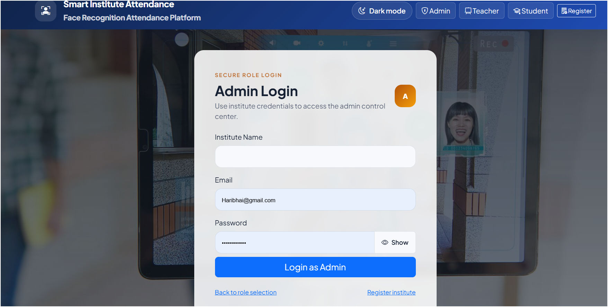
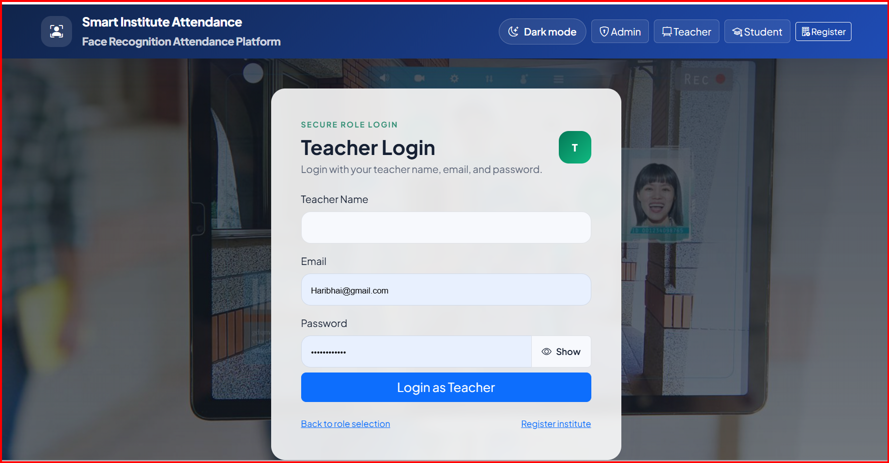
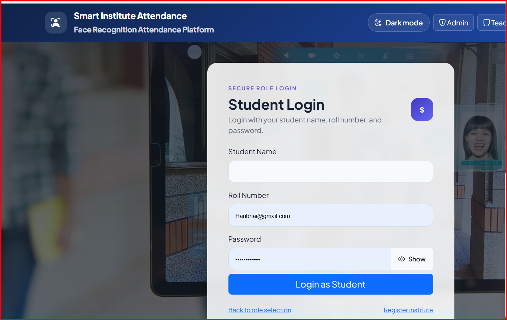
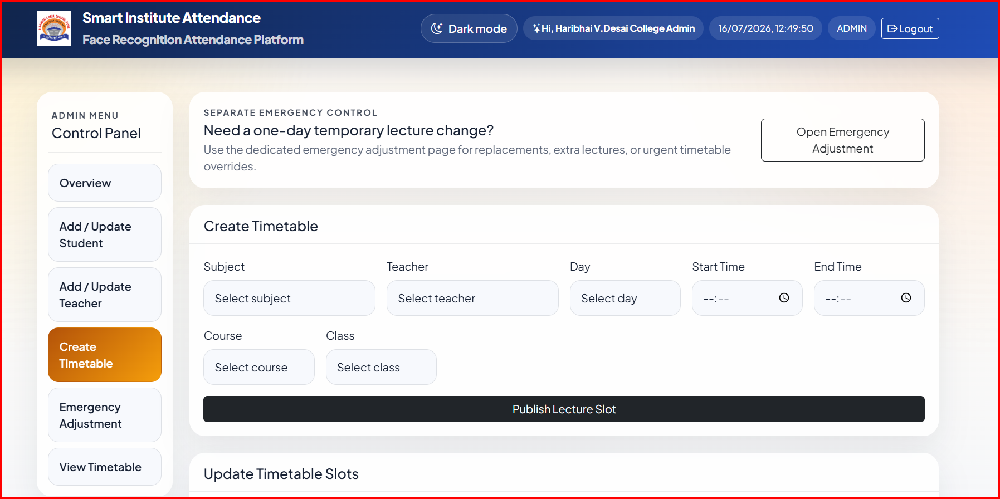
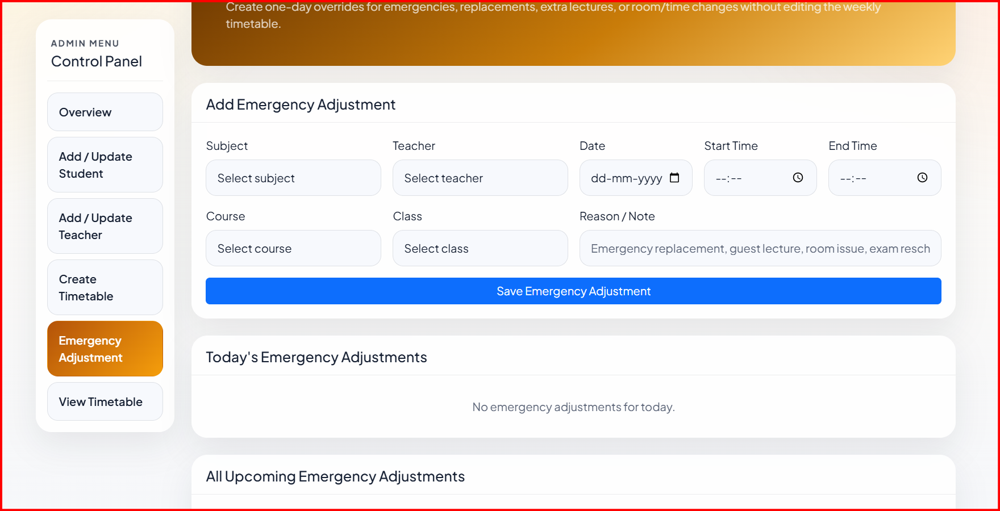
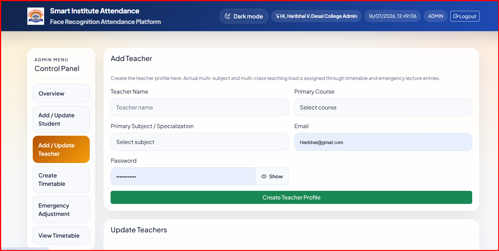
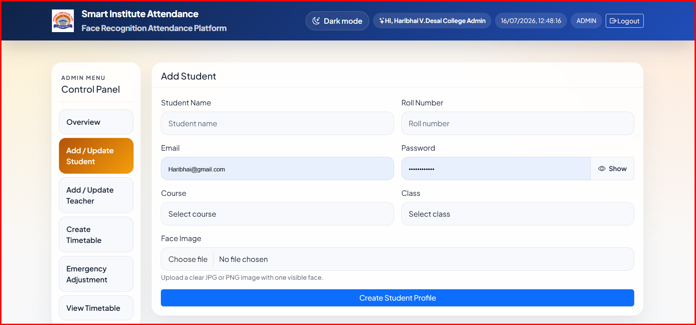

# 🎓 Student Attendance System using Face Recognition

## 📌 Project Overview

The Student Attendance System is a web-based application that automates attendance using Face Recognition technology. The system identifies students through a webcam, records attendance automatically, and stores the data securely in a PostgreSQL database.

---

## 🚀 Features

- 👤 Student Registration
- 📸 Face Image Capture
- 🧠 Face Recognition using OpenCV
- ✅ Automatic Attendance Marking
- 📊 Attendance Records
- 🗄️ PostgreSQL Database Integration
- 🌐 Web-based User Interface

---

## 🛠️ Technologies Used

- Python
- Flask
- OpenCV
- PostgreSQL
- HTML
- CSS
- JavaScript
- Git & GitHub

---

## 📂 Project Structure

```text
web_attendance_system/
│── attendance_system/
│── docs/
│── screenshots/
│── app.py
│── run.py
│── schema.sql
│── requirements.txt
│── README.md
```

---

## 📷 Project Screenshots

###  Admin Login Page


### Teacher Login



### Student Login


### Attendance


### Add timetable


### Emergecy Adjcement


### Attendance Report


### Add or Update Teacher


### Add or Update Student



---

## ⚙️ Installation

1. Clone the repository

```bash
git clone https://github.com/ShrawaniSapate/web_attendance_system.git
```

2. Install dependencies

```bash
pip install -r requirement.txt
```

3. Configure PostgreSQL database.

4. Run the project

```bash
python run.py
```

---

## 🔮 Future Enhancements

- Email Notifications
- QR Code Attendance
- Cloud Deployment
- Mobile Application
- AI-based Attendance Analytics

---

## 👩‍💻 Author

**Shrawani Sapate**
